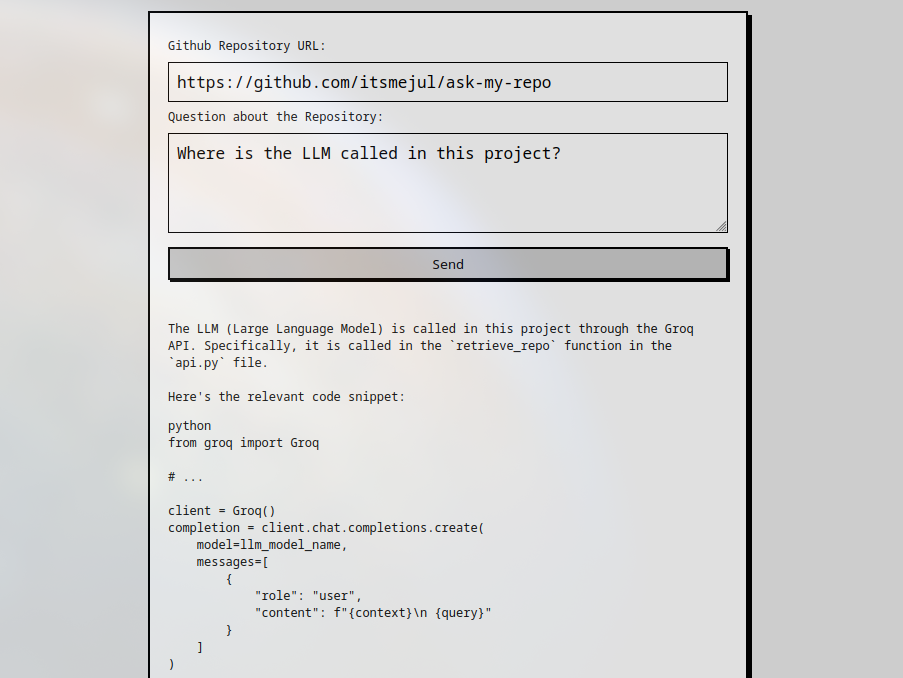

# AskMyRepo
## Overview
Did you ever want to ask an LLM a question about some code project, but it was too tedious to either clone the repository and set up integration, or to find the relevant files and copy the contents into the LLM context?  
Enter AskMyRepo, a super simple RAG agent for Github Repos.  
Just paste the link to a public repository and your question, and it will handle the rest. No more searching through folders on github and copying code.  
You can try it here: https://ask-my-repo.jmosig.com .

Note that this project is still very much in development, and the current version should be considered a proof-of-concept.



## Features
AskMyRepo works with any public Github repository. Note that the initial indexing (when a repository is queried for the first time) might take some time, but subsequent queries to the same repositories should be very fast (Thanks, Qdrant!).

## Architecture

  

We use a microservice architecture consisting of three Flask services ```gateway```, ```index```, and ```retrieve```. The main reason for this was that the indexing can take a long time depending on the repository size, so it should be it's own service that can be scaled independently. Also, this way the ```gateway``` acts as just an interface between ```frontend``` and the other services, which provides a clean separation of responsibility.

### Frontend
The frontend is just an HTML site that will interact with ```gateway``` when a query is to be sent.

### Nginx
Nginx is used a reverse proxy to route external http requests to the correct internal services, and it also enables HTTPS.

### Gateway
The gateway processes requests from the frontend and especially checks whether the repository has already been indexed. Based on that, it will start the index or retrieval service.

### Retrieve, Groq
This service is responsible for performing retrieval on a given, already indexed repository using a user query. It fetches the specified collection from Qdrant, converts it into a LlamaIndex Index and retrieves the most relevant files. Then, it uses those files to provide context to the LLM (which is accessed via Groq API) to answer the query.

### Index, Celery, Redis
This service will convert repository files into vetor embeddings and save them to Qdrant.  
Since the indexing can take very long, we offload it to a Celery worker which can do it in the background. For the broker for Celery, we use Redis.  
Also, the index service will check Redis to prevent two indexing jobs with the same repository from starting.

### Qdrant
Qdrant is an open-source vector search engine, which is used to save the vector embeddings of each repository.

## Local Installation
To run it locally, follow these steps:
- Clone the repository
- Add your Huggingface and Groq keys in common-example.env und retrieve/example.env. Also, change any IP adresses and ports that might be different for you. Then, rename these to ```common.env``` and ```retrieve/.env```:  
    - ```mv common-example.env common.env```  
    - ```mv retrieve/example.env retrieve/.env```

- Finally, just run ```docker compose up --build``` to build and run.
